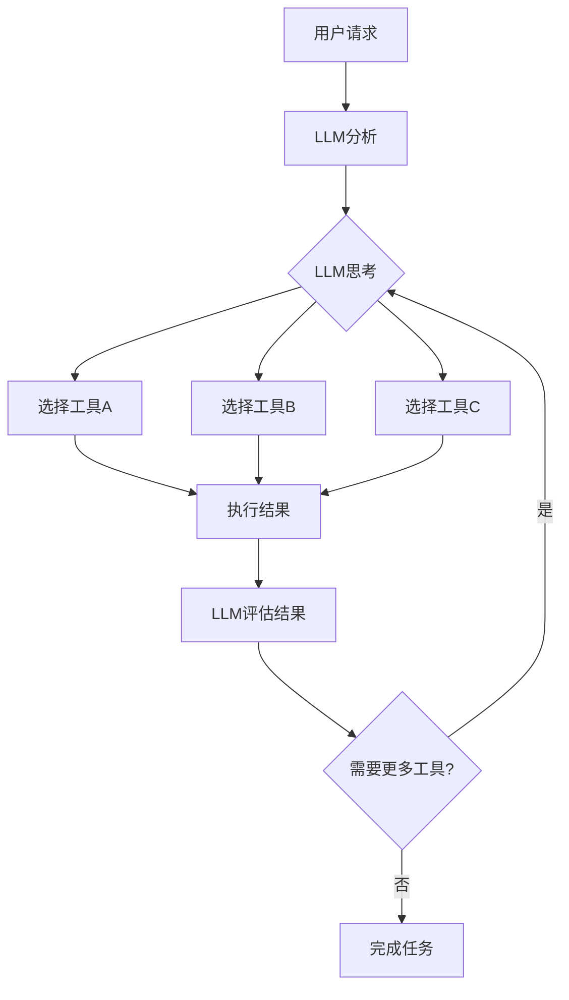

# Tool-based AI Agent 架构详解

## 🔧 为什么需要 Tool 概念？

您指出的问题非常正确！在现代 AI Agent 系统中，**Tool Calling** 是核心概念，而我之前的设计确实缺少了这个关键要素。

### 传统系统 vs Tool-based 系统

| 特征 | 传统固定流程 | LLM Agent编排 | **Tool-based系统** |
|------|-------------|---------------|-------------------|
| 执行方式 | 硬编码步骤 | 预定义Agent | 🔧 **LLM动态选择工具** |
| 灵活性 | ❌ 固定 | ⚠️ 受限于Agent | ✅ **完全动态** |
| 扩展性 | ❌ 难扩展 | ⚠️ 需要新Agent | ✅ **插件式工具** |
| 智能程度 | ❌ 无智能 | ⚠️ 有限智能 | ✅ **真正智能** |

## 🚀 Tool-based 架构核心优势

### 1. **LLM 主导决策**


### 2. **动态工具选择**
LLM 不再受限于预设的Agent，而是可以：
- **按需选择** - 根据具体任务选择最合适的工具
- **组合使用** - 灵活组合多个工具完成复杂任务
- **智能排序** - 根据依赖关系自动安排执行顺序

### 3. **工具生态系统**
```go
// 工具接口标准化
type Tool interface {
    GetName() string
    GetDescription() string  
    GetParameters() ToolParameters
    Execute(args map[string]interface{}) (*ToolResult, error)
}
```

## 🛠️ 具体实现解析

### 工具定义示例

#### 内容分析工具
```go
type ContentAnalysisTool struct{}

func (t *ContentAnalysisTool) GetDescription() string {
    return "Analyze user input to understand content requirements and suggest optimal processing strategy"
}

func (t *ContentAnalysisTool) GetParameters() ToolParameters {
    return ToolParameters{
        Type: "object",
        Properties: map[string]ToolProperty{
            "user_text": {
                Type:        "string",
                Description: "User's original request text",
            },
            "context": {
                Type:        "object", 
                Description: "Additional context information",
            },
        },
        Required: []string{"user_text"},
    }
}
```

#### 脚本生成工具
```go
type ScriptGenerationTool struct{}

func (t *ScriptGenerationTool) GetParameters() ToolParameters {
    return ToolParameters{
        Type: "object",
        Properties: map[string]ToolProperty{
            "content_type": {
                Type:        "string",
                Description: "Type of content (educational, commercial, entertainment)",
                Enum:        []string{"educational", "commercial", "entertainment", "news"},
            },
            "target_audience": {
                Type:        "string",
                Description: "Target audience for the video",
                Default:     "general",
            },
            "style": {
                Type:        "string", 
                Description: "Video style and tone",
                Default:     "professional",
            },
        },
        Required: []string{"content_type", "target_audience"},
    }
}
```

### LLM 工具调用流程

#### 1. 系统提示词设计
```go
func (o *ToolBasedOrchestrator) buildSystemPrompt() string {
    return `You are an intelligent video generation orchestrator. Your job is to help users create videos by using the available tools strategically.

AVAILABLE TOOLS:
- analyze_content: Analyze user input to understand content requirements
- generate_script: Generate video script based on requirements  
- generate_images: Generate images for video scenes using AI
- generate_voice: Generate voice narration using text-to-speech
- check_quality: Analyze and validate content quality
- render_video: Render final video from components

INSTRUCTIONS:
1. Analyze the user's request to understand what type of video they want
2. Use tools step by step to gather information, generate content, and create the final video
3. Always start with content analysis to understand the requirements
4. Choose tools based on the specific needs of each request
5. Check quality before finalizing
6. Only indicate completion when you have successfully created a video file

DECISION MAKING PRINCIPLES:
- For educational content: prioritize accuracy and clarity
- For commercial content: focus on visual impact and persuasion  
- For entertainment: emphasize creativity and engagement
- Always consider the target audience
- Use quality checks for important content
- Be efficient but don't compromise on quality

You must use tools to accomplish tasks. Do not try to generate content directly.`
}
```

#### 2. LLM 多轮对话
```go
// 与LLM进行多轮对话，直到任务完成
for iteration := 0; iteration < o.maxIterations; iteration++ {
    // 调用LLM获取下一步动作
    response, err := o.callLLMWithTools(messages)
    
    // 检查是否有工具调用
    if len(response.ToolCalls) == 0 {
        // LLM认为任务已完成
        break
    }
    
    // 执行所有工具调用
    for _, toolCall := range response.ToolCalls {
        result, err := o.executeToolCall(toolCall)
        
        // 将工具结果添加到消息历史
        resultJSON, _ := json.Marshal(result.Data)
        messages = append(messages, ChatMessage{
            Role:       "tool",
            Content:    string(resultJSON),
            ToolCallID: toolCall.ID,
            Name:       toolCall.Function.Name,
        })
    }
}
```

## 🎯 实际执行案例

### 案例：创建教育视频

#### LLM 第1轮思考
```
用户请求："制作一个解释人工智能历史的教育视频"

LLM 分析：
- 这是教育内容，需要准确性和清晰度
- 需要先分析内容特点
- 选择工具：analyze_content
```

#### LLM 调用工具
```json
{
  "tool_calls": [
    {
      "id": "call_1",
      "type": "function",
      "function": {
        "name": "analyze_content",
        "arguments": {
          "user_text": "制作一个解释人工智能历史的教育视频",
          "context": {}
        }
      }
    }
  ]
}
```

#### 工具执行结果
```json
{
  "success": true,
  "data": {
    "content_type": "educational",
    "complexity": "medium",
    "target_audience": "general",
    "estimated_duration": 90,
    "key_topics": ["ai_origins", "machine_learning", "deep_learning", "current_applications"],
    "recommended_style": "professional"
  },
  "next_tools": ["generate_script"]
}
```

#### LLM 第2轮思考
```
工具结果显示这是中等复杂度的教育内容，目标受众是普通大众。
基于分析结果，我需要生成一个结构化的教学脚本。
选择工具：generate_script
```

#### LLM 继续调用工具
```json
{
  "tool_calls": [
    {
      "id": "call_2", 
      "type": "function",
      "function": {
        "name": "generate_script",
        "arguments": {
          "content_type": "educational",
          "target_audience": "general",
          "style": "professional",
          "duration": 90,
          "key_points": ["ai_origins", "machine_learning", "deep_learning", "current_applications"]
        }
      }
    }
  ]
}
```

### 智能工具选择的优势

#### 根据内容类型动态调整
```
教育视频流程：
analyze_content → generate_script → generate_images → generate_voice → check_quality → render_video

商业视频流程：  
analyze_content → generate_images → generate_script → generate_voice → render_video

新闻视频流程：
analyze_content → generate_script → generate_voice → render_video
```

#### 质量驱动的自适应
```json
// 如果质量检查发现问题
{
  "quality_check_result": {
    "quality_score": 0.65,
    "issues": ["script_clarity_low", "image_quality_poor"]
  }
}

// LLM 自动选择优化工具
{
  "tool_calls": [
    {
      "function": {
        "name": "generate_script",
        "arguments": {
          "refinement": "improve_clarity",
          "previous_script": "...",
          "issues": ["script_clarity_low"]
        }
      }
    },
    {
      "function": {
        "name": "generate_images", 
        "arguments": {
          "enhancement": "higher_quality",
          "previous_prompts": "...",
          "issues": ["image_quality_poor"]
        }
      }
    }
  ]
}
```

## 🔧 新的 API 接口

### Tool-based 视频生成
```bash
curl -X POST http://localhost:8080/api/v1/video/generate-tools \
  -H "Content-Type: application/json" \
  -d '{
    "text": "创建一个关于AI发展历程的教育视频",
    "style": "专业教育风格"
  }'
```

### 查看可用工具
```bash
curl http://localhost:8080/api/v1/tools/list
```

**响应示例：**
```json
{
  "code": 200,
  "message": "success",
  "data": {
    "total_tools": 6,
    "tools": [
      {
        "name": "analyze_content",
        "description": "Analyze user input to understand content requirements",
        "parameters": {
          "type": "object",
          "properties": {
            "user_text": {
              "type": "string",
              "description": "User's original request text"
            }
          },
          "required": ["user_text"]
        }
      }
    ]
  }
}
```

### 查看工具执行日志
```bash
curl http://localhost:8080/api/v1/tools/execution/{taskId}
```

**响应示例：**
```json
{
  "code": 200,
  "message": "success", 
  "data": {
    "task_id": "task_123",
    "tool_calls": [
      {
        "tool_call_id": "call_1",
        "tool_name": "analyze_content",
        "arguments": {
          "user_text": "创建一个关于AI的教育视频"
        },
        "result": {
          "success": true,
          "content_type": "educational",
          "complexity": "medium"
        },
        "timestamp": 1640995200,
        "duration_ms": 500
      }
    ],
    "total_calls": 5,
    "execution_model": "LLM-driven tool selection"
  }
}
```

## 🆚 三种模式对比

### 1. 固定工作流 (Fixed Workflow)
```bash
POST /api/v1/video/generate
```
- **执行方式**: 硬编码4步流程
- **适用场景**: 简单标准化任务
- **优势**: 快速、可预测
- **劣势**: 不灵活、无法适应复杂需求

### 2. LLM Agent 编排 (LLM Orchestrated)
```bash
POST /api/v1/video/generate-smart
```
- **执行方式**: LLM选择预定义Agent
- **适用场景**: 需要智能分析的任务
- **优势**: 有一定灵活性
- **劣势**: 受限于预定义的Agent

### 3. Tool-based 编排 (Tool-based)
```bash
POST /api/v1/video/generate-tools
```
- **执行方式**: LLM动态选择和组合工具
- **适用场景**: 复杂多变的任务
- **优势**: 完全灵活、真正智能
- **劣势**: 复杂度较高

## 🎯 Tool-based 的核心价值

### 1. **真正的智能决策**
LLM 不再是按模板选择，而是根据具体情况**理解→分析→决策→执行**

### 2. **无限扩展性**
新增工具只需实现 Tool 接口，LLM 自动学会使用

### 3. **自适应能力**
根据执行结果动态调整策略，真正做到"随机应变"

### 4. **可观测性**
完整的工具调用链路，每一步都可追溯和分析

### 5. **标准化接口**
所有工具遵循统一接口，易于管理和维护

---

通过引入 **Tool 概念**，我们的系统真正实现了从"机械执行"到"智能协作"的升级。LLM 不再是简单的规划器，而是成为了真正能够**理解任务、选择工具、协调执行**的智能编排器！

这就是现代 AI Agent 系统的核心 - **LLM + Tools 的完美结合**！🔧🚀 